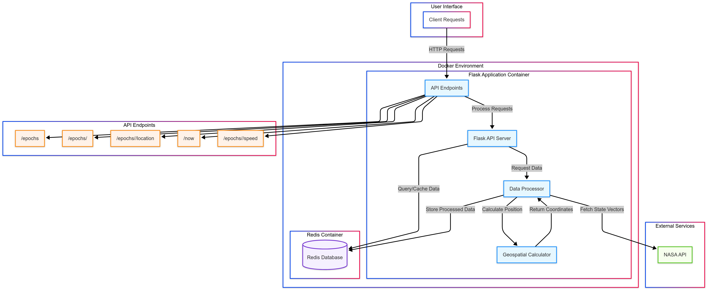

# ISS Tracker

## Overview
The ISS Tracker is a Flask-based web application that provides real-time and historical location data for the International Space Station (ISS). The project retrieves ISS state vectors, calculates geospatial data, and serves it through multiple API endpoints. It uses Redis for data storage and is containerized using Docker Compose.

## Data Source
The ISS state vector data is sourced from [NASA's API](https://nasa-public-data.s3.amazonaws.com/iss-coords/current/ISS_OEM/ISS.OEM_J2K_EPH.xml). This data is processed to determine ISS position, velocity, and other relevant details.

## Deployment with Docker Compose
To deploy the ISS Tracker using Docker Compose:

```sh
# Clone the repository
git clone <repository_url>
cd iss-tracker

# Build and start the containerized application
docker compose up --build -d
```

To stop and remove the containers:

```sh
docker compose down
```

## API Endpoints & Usage

### 1. Get All Epochs
```sh
curl http://localhost:5000/epochs
```
**Response:** A list of available epochs.

### 2. Get Data for a Specific Epoch
```sh
curl http://localhost:5000/epochs/<epoch>
```
**Response:**
```json
{
  "epoch": "2024-03-27T12:00:00Z",
  "position": { "x": 12345.67, "y": 89012.34, "z": 56789.01 },
  "velocity": { "x": 7.5, "y": -2.3, "z": 4.8 }
}
```

### 3. Get ISS Location for a Specific Epoch
```sh
curl http://localhost:5000/epochs/<epoch>/location
```
**Response:**
```json
{
  "latitude": 34.0522,
  "longitude": -118.2437,
  "altitude": 420.5,
  "geoposition": "Los Angeles, CA, USA"
}
```

### 4. Get Current ISS Location
```sh
curl http://localhost:5000/now
```
**Response:** Similar to the `/epochs/<epoch>/location` endpoint, but retrieves the closest available epoch to the current time.

### 5. Get ISS Speed at a Specific Epoch
```sh
curl http://localhost:5000/epochs/<epoch>/speed
```
**Response:**
```json
{
  "speed": 27600.5
}
```
(The speed is in km/h.)

## Running Unit Tests in Docker
To run the containerized unit tests:

```sh
docker exec -it iss-tracker pytest
```

## Important Files
- `iss_tracker.py` - Main Flask application handling API routes.
- `Dockerfile` - Defines the container setup.
- `docker-compose.yml` - Configures services and dependencies.
- `requirements.txt` - Lists required Python packages.
- `test_iss_tracker.py` - Unit tests for API functionality.
- `Diagram.png` - System architecture diagram.

## Architecture Diagram


This diagram illustrates how the Flask API, Redis database, and Docker components interact.

